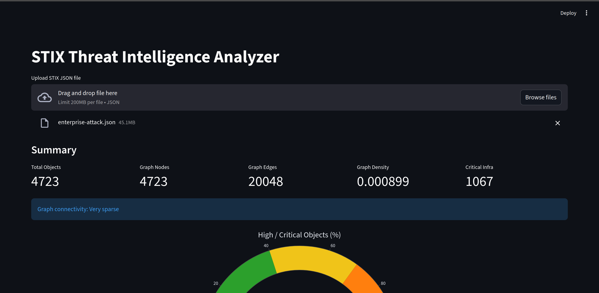
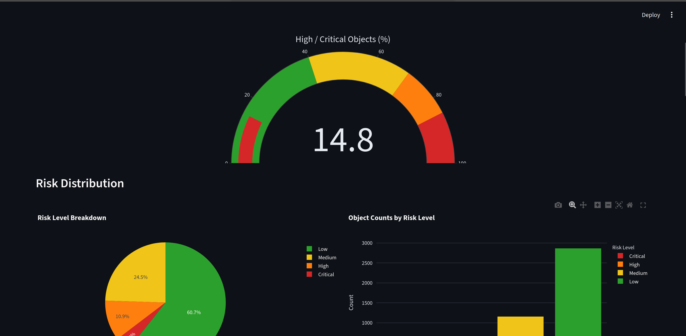
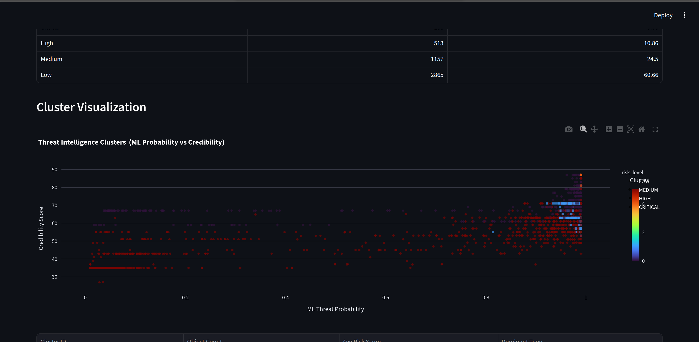
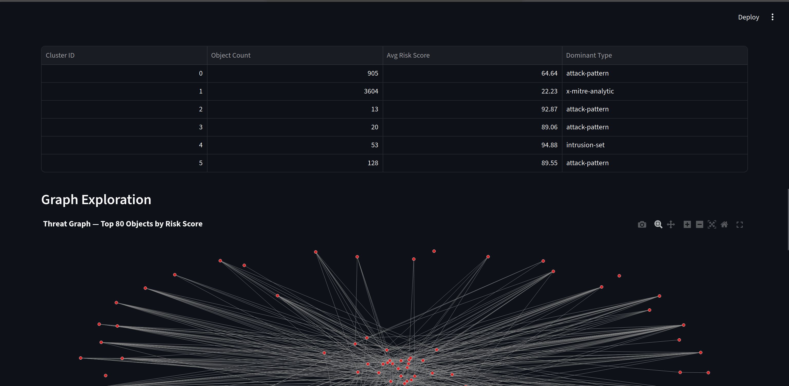
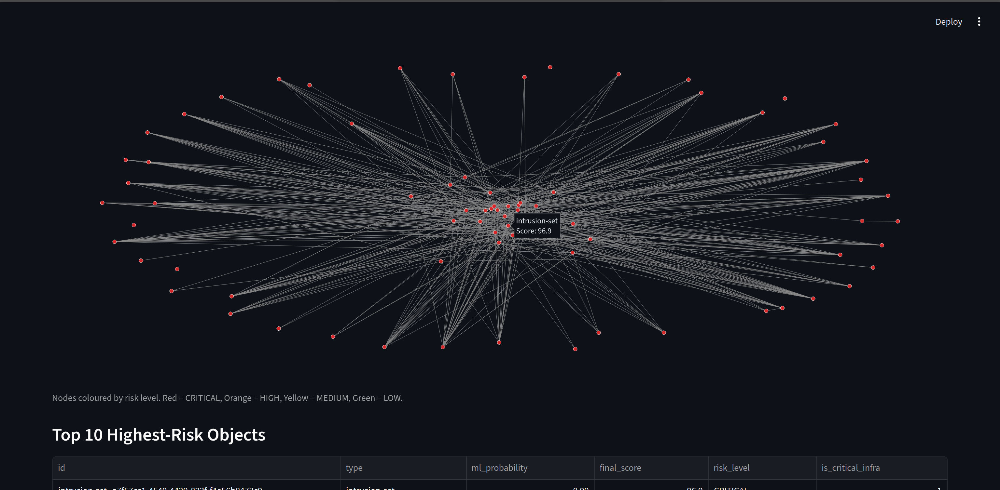
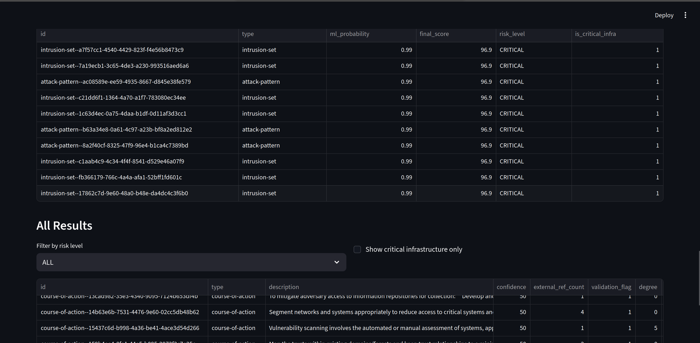

# STIX Threat Intelligence Analyzer

A threat intelligence pipeline that parses STIX 2.x bundles, builds a directed relationship graph, scores every object by risk using ML and anomaly detection, and visualizes results through an interactive Streamlit dashboard backed by a FastAPI endpoint.

Built using the [MITRE ATT&CK Enterprise](https://attack.mitre.org/) dataset.

---

## Screenshots


*Summary panel — total objects, graph stats, and critical infrastructure count*


*Risk level breakdown — speedometer, pie chart, and bar chart*


*KMeans cluster scatter plot — ML probability vs credibility score*


*Cluster summary table and graph exploration panel*


*Interactive threat graph — top 80 objects by risk score, coloured by risk level*


*Full results table with risk level filter and critical infrastructure toggle*

---

## Features

- Parses STIX 2.x JSON bundles and builds a directed graph using NetworkX
- Computes PageRank, degree centrality, and graph density per object
- Extracts TF-IDF text features from object type and description
- Scores credibility using external references, validation, graph degree, and confidence
- Trains a Logistic Regression classifier to assign ML threat probability
- Runs IsolationForest anomaly detection to flag outlier objects
- Applies KMeans clustering to group objects by numeric feature similarity
- Flags critical infrastructure objects using type and keyword matching
- Calculates a final weighted risk score and buckets into CRITICAL / HIGH / MEDIUM / LOW
- Exposes results via an async FastAPI `/analyze` endpoint
- Visualizes everything in a Streamlit dashboard with graph exploration and cluster scatter plots
- Memory-optimized JSON parsing using generators and float32/categorical dtypes

---

## Tech Stack

| Layer | Tools |
|---|---|
| Data Parsing | Python, JSON, NetworkX |
| ML & Scoring | Scikit-Learn, SciPy |
| Anomaly Detection | IsolationForest |
| Clustering | KMeans |
| API | FastAPI, Uvicorn |
| Dashboard | Streamlit, Plotly |
| Data | MITRE ATT&CK STIX 2.1 |

---

## Project Structure

```
stix-threat-analyzer/
│
├── data/
│   ├── stix10/
│   │   └── STIX_URL_Watchlist.xml
│   ├── stix20/
│   │   └── enterprise-attack.json
│   └── stix21/
│       └── enterprise-attack.json
│
├── models/                        # auto-generated by pipeline.py
│   ├── model.pkl
│   ├── vectorizer.pkl
│   ├── scaler.pkl
│   ├── iso_forest.pkl
│   └── kmeans.pkl
│
├── assets/                        # screenshots for this README
│   ├── ss1.png
│   ├── ss2.png
│   ├── ss3.png
│   ├── ss4.png
│   ├── ss5.png
│   └── ss6.png
│
├── pipeline.py                    # trains and saves all models
├── api.py                         # FastAPI backend
├── dashboard.py                   # Streamlit frontend
├── requirements.txt
├── .gitignore
└── README.md
```

---

## Quickstart

### 1. Install dependencies

```bash
pip install fastapi uvicorn streamlit pandas numpy scipy scikit-learn networkx plotly requests
```

### 2. Train the models

```bash
python pipeline.py
```

This reads `data/stix21/enterprise-attack.json`, trains all models, and saves them to `models/`. Only needs to run once, or when the data changes.

### 3. Start the API

```bash
uvicorn api:app --reload
```

API runs at `http://127.0.0.1:8000`. Leave this terminal open.

### 4. Start the dashboard

```bash
streamlit run dashboard.py
```

Opens at `http://localhost:8501` in your browser. Upload either STIX 2.0 or 2.1 JSON file to analyze.

---

## API Reference

### `GET /`
Health check.

```json
{ "message": "STIX Threat Intelligence API is running" }
```

### `POST /analyze`
Upload a STIX 2.x JSON file. Returns full risk analysis.

```bash
curl -X POST "http://127.0.0.1:8000/analyze" \
  -F "file=@data/stix21/enterprise-attack.json"
```

**Response keys:**

| Key | Description |
|---|---|
| `total_objects` | Number of non-relationship STIX objects parsed |
| `graph` | `nodes`, `edges`, `density` |
| `risk_distribution` | Count and percent for CRITICAL / HIGH / MEDIUM / LOW |
| `top_10` | Top 10 objects by final risk score |
| `cluster_data` | Per-cluster summary — count, avg score, dominant type |
| `graph_data` | Node positions and edges for the top 80 objects |
| `results` | Full scored dataset with all computed columns |

**Result columns:**

`id` · `type` · `description` · `confidence` · `external_ref_count` · `validation_flag` · `degree` · `pagerank` · `ml_probability` · `anomaly_flag` · `credibility_score` · `final_score` · `risk_level` · `is_critical_infra` · `cluster`

---

## Risk Score Formula

```
final_score = (0.5 × ml_probability + 0.2 × credibility/100 + 0.2 × anomaly_flag + 0.1 × is_critical_infra) × 100
```

| Score | Risk Level |
|---|---|
| ≥ 85 | CRITICAL |
| ≥ 70 | HIGH |
| ≥ 40 | MEDIUM |
| < 40 | LOW |

---

## Credibility Score Formula

```
credibility = external_refs (40pts) + valid_id_format (20pts) + graph_degree (20pts) + confidence (20pts)
```

Objects with a missing confidence field are penalised at 70% of their confidence value.

---

## How to Interpret Results

| Output | What it means |
|---|---|
| `ml_probability` near 1.0 | Model is confident this is a threat object |
| `anomaly_flag = 1` | Object looks statistically unusual compared to others |
| `is_critical_infra = 1` | Object is a vulnerability type or matches infrastructure keywords |
| `cluster` | KMeans group — objects in the same cluster share similar numeric profiles |
| Graph density near 0 | Sparse network — normal for ATT&CK bundles |

---

## .gitignore

```
data/
models/
__pycache__/
*.pyc
.env
```

---

## License

MIT

---

## Author

Project by Adithya
